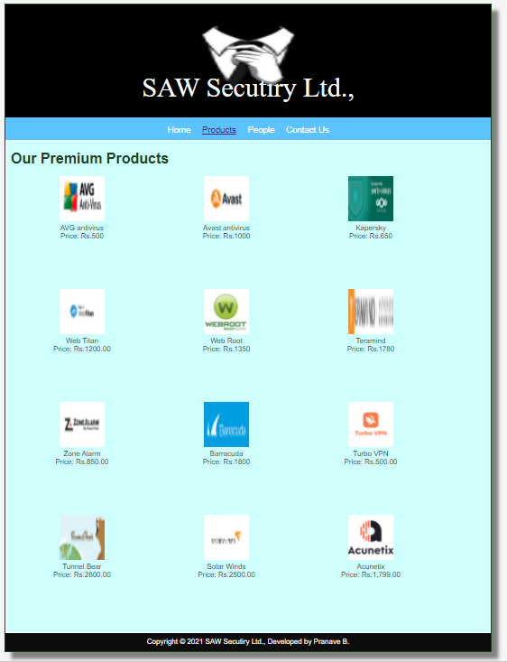

# Web Design for a Software Product Company

## AIM:

To design a static website for a software product company company.

## DESIGN STEPS:

### Step 1:

Requirement collection.

### Step 2:

Creating the layout using HTML and CSS.

### Step 3:

Updating the sample content.

### Step 4:

Choose the appropriate style and color scheme.

### Step 5:

Validate the layout in various browsers.

### Step 6:

Validate the HTML code.

### Step 6:

Publish the website in the given URL.

## PROGRAM :

### Layout.css
~~~
* {
  box-sizing: border-box;
  font-family: Arial, Helvetica, sans-serif;
}
body {
  background-color: whitesmoke;
  color: #17421d;
}
.container {
  width: 1080px;
  margin-left: auto;
  margin-right: auto;
  border-width: 1px 1px 1px 1px;
  border-style: solid;
  box-shadow: 15px 15px 8px gray;
}

.banner {
  display: block;
  width: 100%;
  height: 250px;
  text-align: center;
  font-size: 60px;
  font-family: 'Times New Roman', Times, serif;
  background-image: url("/static/img/prana4.jpg");
  background-size: 100% 100%;
  margin: 0px 0px 0px 0px;
  padding-top: 150px;
  color: #ffffff;
}

.menu {
  display: block;
  width: 100%;
  height: 50px;
  font-size: larger;
  background-color: #5bc3ff;
  text-align: center;
  padding-top: 15px;
  margin: 0px 0px 0px 0px;
  border-width: 1px;
}

.menuitem {
  display: inline-block;
  margin-left: 10px;
  margin-right: 10px;
}
.menuitemselected {
  display: inline-block;
  margin-left: 10px;
  margin-right: 10px;
  color: #b0aeb4;
}

.menuitem a {
  text-decoration: none;
  color: #ffffff;
}

.content {
  display: block;
  width: 100%;
  background-color: #cffffd;
  min-height: 500px;
  margin: 0px 0px 0px 0px;
  border-width: 1px;
  border-color: white;
  border-style: solid;
}
.homecontent {
  min-height: 500px;
  margin: 10px 10px 10px 10px;
}
.homecontent h1 {
  text-align: left;
}
.homecontent img {
  float: right;
  width: 400px;
  height: 300px;
  margin-left: 10px;
}

.contenttext {
  text-align: justify;
}

.productcontent {
  min-height: 500px;
  margin: 10px 10px 10px 10px;
}

.productcontent h1 {
  text-align: left;
}

.productitems {
  display: block;
}

.productitem {
  display: inline-block;
  width: 30%;
  height: 250px;
  text-align: center;
}

.productitem img {
  width: 100px;
  height: 100px;
  display: block;
}
.productitem .itemimage {
  display: block;
  margin-left: auto;
  margin-right: auto;
  width: 100px;
  margin-bottom: 5px;
}

.productitem .itemname {
  display: block;
}
.productitem .itemprice {
  display: block;
}

.footer {
  display: block;
  width: 100%;
  height: 40px;
  background-color: #0c0c0c;
  text-align: center;
  padding-top: 10px;
  margin: 0px 0px 0px 0px;
  color: #fcf7f7;
}

~~~

### Home Page:
~~~
<!DOCTYPE html>
<html lang="en">
  <head>
    <title> SAW Secutiry Ltd.,</title>
    <link rel="stylesheet" href="./css/layout.css" />
    <link rel="icon" href="./img/icon.png" type="image/x-icon" />
  </head>

  <body>
    

      
S.A.W Security Ltd.,

      

        
<a href="/static/home.html">Home</a>

        
<a href="/static/products.html">Products</a>

        
<a href="/static/people.html">People</a>

        
<a href="/static/Contact Us.html">Contact Us</a>

      

      

        

          <h1>About Us</h1>
          
          

            Public statement about information security at S.A.W Access

 
 
            S.A.W is committed to protecting its information assets to satisfy the company business objectives and meet the information security requirements of its customers while maintaining the safety of individuals and protecting their right to privacy. The Information Security Policy expresses the company intentions and commitment towards these goals.
            This Statement complements S.A.W Information Security Policy and provides a summary of the company internal security policies and procedures which constitute the security baseline that governs the company Software as a Service (SaaS) Platform. The Statement aim is to provide assurance to interested parties about the security of the SaaS applications, as well as the data contained within them.
                 
            
            
            The Principle of Least Privilege (POLP) is enshrined at S.A.W in policy and in culture.
            
            Access is granted on a Need to Know or Need to Use basis only.
            
           . If you have any questions about the below, please contact us at 
            
           
            <ul>
              <li>S.A.W closely manages suppliers using risk management principles.</li>
              <li>S.A.W hardens all network services and firewalls.</li>
              <li>AES-256 is used to protect data at rest.</li>
            </ul>
          

        

      

      

        Copyright &#169; 2021 SAW Secutiry Ltd., Developed by Pranave B.
      

    

  </body>
</html>

~~~
### Products Page:
~~~
<!DOCTYPE html>
<html lang="en">
  <head>
    <title>SAW Secutiry Ltd.,</title>
    <link rel="stylesheet" href="./css/layout.css" />
    <link rel="icon" href="./img/icon.png" type="image/x-icon" />
  </head>

  <body>
    

      
SAW Secutiry Ltd.,

      

        
<a href="/static/home.html">Home</a>

        

          <a href="/static/products.html">Products</a>
        

        
<a href="/static/people.html">People</a>

        
<a href="/static/contact Us.html">Contact Us</a>

      

      

        
    
          <h1>Our Premium Products</h1>
          

              
 
                  

                  
                  

                  
AVG antivirus

                  
Price: Rs.500 

              

              
 
                  

                  
                  

                  
Avast antivirus

                  
Price: Rs.1000 

              

              
 
                

                
                

                
Kapersky

                
Price: Rs.650 

              

              
 
                

                
                

                
Web Titan

                
Price: Rs.1200.00 

              

              
 
                

                
                

                
Web Root

                
Price: Rs.1350 

              

              

                

                
                

                
Teramind

                
Price: Rs.1780 

              

              
 
                

                
                

                
Zone Alarm

                
Price: Rs.850.00 

              

              
 
                

                
                

                
Barracuda

                
Price: Rs.1800

              

              
 
                

                
                

                
Turbo VPN

                
Price: Rs.500.00 

              

              
 
                

                
                

                
Tunnel Bear

                
Price: Rs.2800.00 

              

              
 
                

                
                

                
Solar Winds

                
Price: Rs.2500.00 

              

              
 
                

                
                

                
Acunetix

                
Price: Rs.1,799.00 

              

          

          
        
      

      

        Copyright &#169; 2021 SAW Secutiry Ltd., Developed by Pranave B.
      

    

  </body>
</html>
~~~
### People page:
~~~
<!DOCTYPE html>
<html lang="en">
    <head>
        <title>SAW Secutiry Ltd.</title>
        <link rel="stylesheet" href="./css/layout.css" />
        <link rel="icon" href="./img/icon.png" type="image/x-icon" />
    </head>
    <body>
        

            
SAW Secutiry Ltd.,

            

                
<a href="/static/home.html">Home</a>

                
<a href="/static/products.html">Products</a>

                
<a href='/static/people.html'>people</a>

                
<a href='/static/contact Us.html'>contact Us</a>

            

            

                

                    <h1>Our Crew Welcomes You All</h1>
                    

                        

                            

                                
                            

                            
Chief Executive Officer

                            
alexa

                        

                        

                            

                                
                            

                            
Chief Financial Officer

                            
kim

                        

                        

                            

                                
                            

                            
Chief Operating Officer

                            
srisha

                        

                        

                            

                                
                            

                            
Chief Marketing Officer

                            
asifa

                        

                        

                            

                                
                            

                            
Chief Technology Officer

                            
Rohit

                        

                        

                            

                                
                            

                            
President

                            
sahaa

                        

                    

                

            

            

                Copyright &#169; 2021 SAW Secutiry Ltd., Developed by Pranave B.
            

            

        

    </body>
</html>
~~~
### Contact Us page:
~~~
<!DOCTYPE html>
<html lang="en">
    <head>
        <title>SAW Secutiry Ltd.,</title>
        <link rel="stylesheet" href="./css/layout.css" />
        <link rel="icon" href="./img/icon.png" type="image/x-icon" />
    </head>

    <body>
        

            
SAW Secutiry Ltd.,

            

                
<a href="/static/home.html">Home</a>

                
<a href="/static/products.html">Products</a>

                
<a href='/static/people.html'>People</a>

                
<a href='/static/contact Us.html'>About</a>

            

            

                

                    <h1>FEEL FREE TO CONTACT US</h1> 
                    

                        <h2>For Enquiry:</h2>
                        <h3>E-Mail : sawautomobi02@gmail.com</h3> 
                        <h3>NUMBER: +91 9345572665, +91 6865824832</h3> 
                        <h3>ADDRESS: 12B,Richie street,Chennai.</h3> 
                    

                

            

            

            Copyright &#169; 2021 SAW Secutiry Ltd., Developed by Pranave B.
        

            

        

    </body>
</html>
~~~

## OUTPUT:

### Home Page:

### Products Page:

 

### People page:

### Contact Us page:

## Result:

Thus a website is designed for the software product company and the HTML,CSS code are validated.
